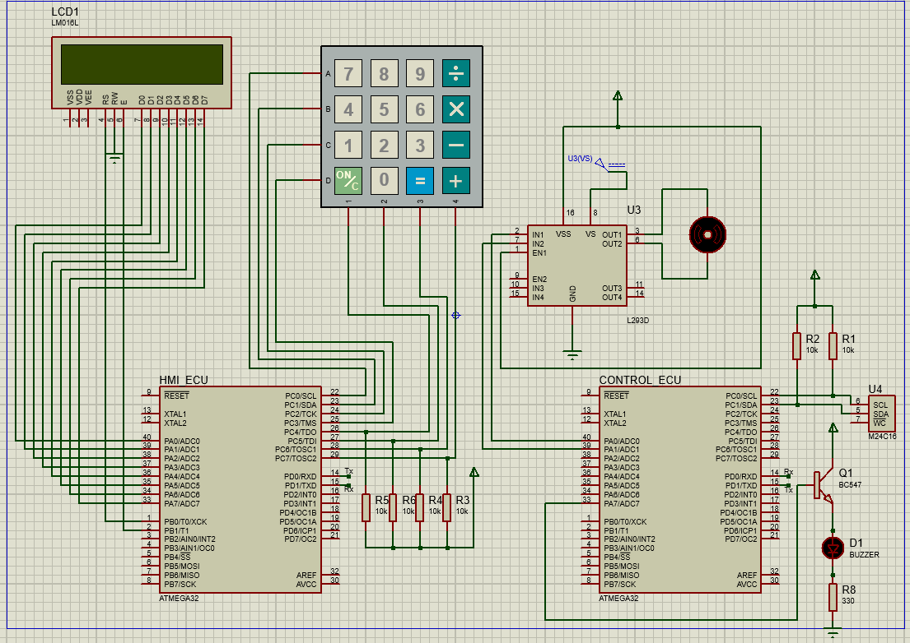

### Door Locker Security System
This project is a door locker security system that uses a password to lock and unlock a door. It is designed for embedded systems applications and uses an AVR microcontroller, a keypad, an LCD screen, a buzzer, and a DC motor.

#### Technologies
###### This project was created using:

- AVR 
- Proteus 8 Professional
- C language


***Launch***
To run this project, *you need to*:
```
Clone this repository to your local machine https://github.com/ZiadSheriif/Door-Locker-Security-System .
```
```
Open the project folder in eclipse .
```
```
Build the project and generate the hex file.
```
```
Open the Proteus simulation file in Proteus 8 Professional.
```
```
Load the hex file into the microcontroller in Proteus.
```
```
Run the simulation and interact with the keypad and LCD screen.
```

#### Scope of functionalities
- **This project has the following functionalities:**

1. Setting a new password: The user can enter a new password using the keypad and confirm it by pressing ‘#’. 


2. The password should be 5 digits long and should not start with ‘#’. 
   - If the password is valid, it is saved in the EEPROM memory and a confirmation message is displayed on the LCD screen. 
   - If the password is invalid, an error message is displayed and the user can try again.


3. Locking and unlocking the door: 
   - The user can lock or unlock the door by entering the correct password and pressing ‘#’. 
      1.  If the password is correct, the DC motor rotates clockwise or anti-clockwise to lock or unlock the door respectively, and a success message is displayed on the LCD screen. 
      2.  If the password is incorrect, a failure message is displayed and the buzzer sounds for one second.
4. User has three attempts to enter the correct password before the system is blocked for one minute.

## Screenshots



>This software is licensed under MIT License, See License for more information ©ZiadSheriif.

